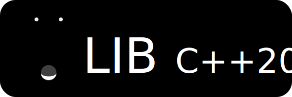

<!-- Badges. Suggest using https://badgen.net or https://shields.io -->

Base template for a C++20 Library (lib) 

_**NOTE:** Though this repo can be used as-is, it is intended for use by the MoonHappy Project Generator utility._

# Overview

This repo consists of sample code and structure of a typical C++20 library. The MoonHappy Project Generator utility uses this base repo to then apply diff patches to customise the template for use with various build (cmake, buck2, etc..) and package management frameworks.

## Features

- [GoogleTest](https://github.com/google/googletest) based Unit Tests.
- [Google C++ Style Guide](https://google.github.io/styleguide/cppguide.html) compliant, verified using [cpplint](https://github.com/cpplint/cpplint).

## Layout

- `/include` - public interface headers (.hpp) should be listed here.
- `/lib` - third-party libraries/submodules should be listed here.
- `/src` - source code (.cpp) and private headers should be listed here.
- `/test` - unit test files, using GoogleTest, should be listed here.
- `.gitignore` - GitHub based C++ ignore list.
- `LICENSE` - MIT license.
- `README.md` - this file explaining the repo contents.
- `TITLE.svg` - banner logo for the repo.

# Acknowledgements

_**NOTE:** Extend this section to acknowledge libraries, code, and contributors of the project._

- [GoogleTest](https://github.com/google/googletest) | Copyright (c) Google Inc.
